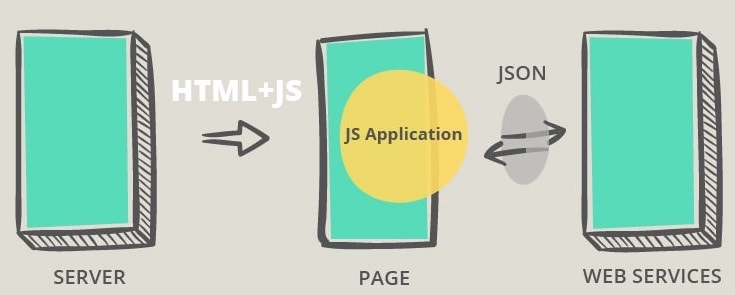
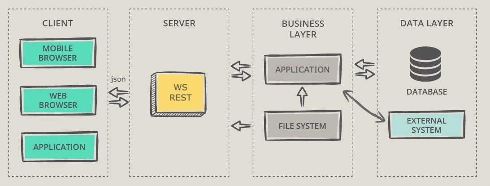

# Aula 3

## Arquitetura Web

### Arquitetura SPA (Single Page Application)

### Arquitetura API

#### Material Complementar

- [Web Application Architecture](https://existek.com/blog/web-application-architecture/)

## REST (Representational State Transfer)

É um modelo de implementação a ser utilizado para projetar sistemas distribuídos.

O padrão REST se baseia em **Recursos**, que nada mais é do que uma abstração sobre um determinado tipo de informação que uma aplicação gerencia. Por exemplo um e-commerce possui: `Cliente`, `Produto`, `Vitrine`, `Carrinho`, `Pedidos`.

## Protocolo HTTP (Hypertext Transfer Protocol)

- URI (Uniform Resource Identifier)
- Method
- Header
- Body

## URI (Uniform Resource Identifier)

A identificação do recurso deve ser feita utilizando-se o conceito de URI. Alguns exemplos de URI’s:

- `http://api-padaria-do-joaquim.com.br/produtos`
- `http://api-padaria-do-joaquim.com.br/clientes`
- `http://api-padaria-do-joaquim.com.br/vendas`

As URI’s são a **interface** de utilização dos serviços e funcionam como um **contrato** que será utilizado pelos clientes para acessá-los.

#### Material Complementar

- [Difference between URI and URL](https://dev.to/flippedcoding/what-is-the-difference-between-a-uri-and-a-url-4455)

## Method / Verbos

Cada recurso pode ser manipulado de diversas maneiras. O usuário pode querer criar um cliente novo, excluir um produto ou alterar um pedido.

Mas a URI do recurso é `http://api-padaria-do-joaquim.com.br/produtos`. Como definir a operação que será realizada ?

| Método    | Ação no Recurso                                                                       |
| --------- | ------------------------------------------------------------------------------------- |
| `GET`     | Solicita a representação de um recurso.                                               |
| `POST`    | Submete os dados para persistência de um recurso.                                     |
| `PUT`     | Substitui **todas** as atuais informações do recurso alvo pelo payload da requisição. |
| `PATCH`   | Aplica modificações **parciais** em um recurso.                                       |
| `DELETE`  | Remove um recurso específico.                                                         |
| `HEAD`    | Similar ao GET, obtém apenas os cabeçalhos de resposta, sem os dados do recurso.      |
| `OPTIONS` | Descreve as opções de comunicação disponíveis para o alvo.                            |

Os métodos mais utilizados são `GET`, `POST`, `PUT` e `DELETE`, mas se fizer sentido em sua aplicação utilizar algum dos outros métodos, não há nenhum problema nisso.

O protocolo possui 9 verbos definidos, veja todos os [HTTP Methods](https://developer.mozilla.org/pt-BR/docs/Web/HTTP/Methods).

## Header

Dados adicionais enviados pelo agente (browser ou outra ferramenta) para dar contexto sobre a transação que está ocorrendo entre o cliente e o servidor. É possível incluir informações customizadas também.

## Request Payload

Corpo da requisição, contém os dados que estão sendo enviados. **ATENÇÃO:** `GET` não deve possuir um _Request Payload_, embora seja possível fazer isso em algumas ferramentas/frameworks (axios, por exemplo, não permite).

## Códigos HTTP

| Categoria | Descrição                                                                                                  |
| --------- | ---------------------------------------------------------------------------------------------------------- |
| `1xx`     | Informational Communicates transfer protocol-level information.                                            |
| `2xx`     | Success Indicates that the client’s request was accepted successfully.                                     |
| `3xx`     | Redirection Indicates that the client must take some additional action in order to complete their request. |
| `4xx`     | Client Error This category of error status codes points the finger at clients.                             |
| `5xx`     | Server Error The server takes responsibility for these error status codes.                                 |

Categorias mais utilizadas:

- `200 OK`
- `201 CREATED`
- `204 NO CONTENT`
- `400 BAD REQUEST`
- `401 UNAUTHORIZED`
- `403 FORBIDDEN`
- `404 NOT FOUND`
- `500 INTERNAL SERVER ERROR`

[HTTP Status Codes](https://restfulapi.net/http-status-codes/)

## Endpoint

Damos o nome de **Endpoint** para a composição de uma chamada REST, ou seja: URI, Method, Header, Body e Response Status

#### Material Complementar

- [Rest: Princípios e boas práticas](http://blog.caelum.com.br/rest-principios-e-boas-praticas/)

## Exemplos

- [Dragões](https://dragons-api.herokuapp.com)
- [Pokemon](https://pokeapi.co)
- [Placeholder](https://jsonplaceholder.typicode.com)
- [De Tudo](https://any-api.com)
